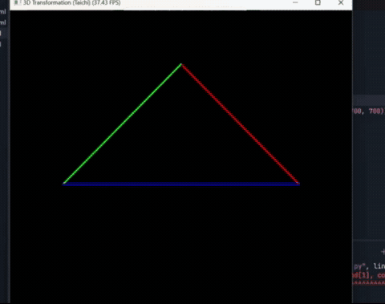

# Ro_tran
# Ro_tran: 3D MVP变换与线框三角形绘制

本项目为图形学实验环境搭建与三维变换理论的实践。基于 Taichi 语言，利用 GPU 并行计算完成模型‑视图‑投影（MVP）矩阵变换，将三维空间中的三角形投影到二维屏幕，并实时展示旋转动画。

## 目录

- [项目概述](#项目概述)
- [项目架构](#项目架构)
- [代码逻辑](#代码逻辑)
  - [全局参数与初始化](#全局参数与初始化)
  - [模型变换 `get_model_matrix`](#模型变换-get_model_matrix)
  - [视图变换 `get_view_matrix`](#视图变换-get_view_matrix)
  - [透视投影 `get_projection_matrix`](#透视投影-get_projection_matrix)
  - [顶点变换核函数 `compute_transform`](#顶点变换核函数-compute_transform)
  - [主循环与交互 `main`](#主循环与交互-main)
- [实现功能](#实现功能)
- [效果展示](#效果展示)

## 项目概述

**Ro_tran** 是一个图形学基础实验项目，旨在深入理解三维图形渲染管线中的坐标变换流程。我们实现了一个三维线框三角形的 MVP 变换，通过键盘控制旋转角度，观察透视投影效果，并掌握 Taichi 框架下的矩阵运算。

## 项目架构

项目仅包含一个 Python 文件 `main.py`，但内部逻辑清晰分离：

```
src/Work1/
└── main.py      # 包含参数定义、变换矩阵生成、渲染循环与交互
```

所有核心功能均使用 Taichi 的 `@ti.func` 和 `@ti.kernel` 编写，充分利用 GPU 并行计算能力。

## 代码逻辑

### 全局参数与初始化

- 使用 `ti.init(arch=ti.cpu)` 初始化 Taichi（可改为 `ti.gpu` 以启用 GPU）。
- 定义两个 `ti.Vector.field`：
  - `vertices`：存储三角形三个顶点的三维坐标。
  - `screen_coords`：存储变换后屏幕坐标（归一化至 `[0,1]` 范围）。
- 三角形初始顶点坐标：
  - \( v_0 = (2.0, 0.0, -2.0) \)
  - \( v_1 = (0.0, 2.0, -2.0) \)
  - \( v_2 = (-2.0, 0.0, -2.0) \)

### 模型变换 `get_model_matrix`


- 接收角度制旋转角，返回绕 Z 轴旋转的模型变换矩阵。
- 内部转换为弧度，构造标准旋转矩阵。

### 视图变换 `get_view_matrix`


- 接收相机位置 `eye_pos`（三维向量）。
- 将相机平移到原点，即世界坐标系中物体位置减去相机位置。

### 透视投影 `get_projection_matrix`

- **参数**：垂直视场角（度）、宽高比、近平面距离、远平面距离（均为正值）。
- **符号处理**：右手坐标系，相机看向 -Z，因此实际近/远平面坐标 `n = -zNear`，`f = -zFar`。
- **步骤**：
  1. 计算视锥体边界：`t = tan(fov/2) * |n|`，`b = -t`，`r = aspect * t`，`l = -r`。
  2. 构造透视→正交挤压矩阵 `M_p2o`。
  3. 构造正交投影矩阵 `M_ortho`（先平移中心到原点，再缩放至 `[-1,1]^3`）。
  4. 组合：`M_proj = M_ortho @ M_p2o`。

### 顶点变换核函数 `compute_transform`


- 固定相机位置 `(0,0,5)`，视场角 45°，宽高比 1.0，近平面 0.1，远平面 50.0。
- 计算 MVP 矩阵（右乘顺序：`proj @ view @ model`）。
- 对每个顶点执行变换，得到齐次裁剪坐标，执行透视除法得到 NDC，最后映射到屏幕坐标范围 `[0,1]`。

### 主循环与交互 `main`

- 创建 700×700 的 GUI 窗口。
- 通过 `a`/`d` 键控制旋转角度（每次 ±10°）。
- 每帧调用 `compute_transform` 更新屏幕坐标，然后绘制三条边（红、绿、蓝）。

## 实现功能

- **模型变换**：三角形绕 Z 轴匀速旋转，演示模型坐标系到世界坐标系的变换。
- **视图变换**：相机位置固定为 `(0,0,5)`，可观察透视投影效果。
- **透视投影**：正确实现透视投影矩阵，产生近大远小的视觉效应。
- **GPU 并行**：所有矩阵运算均在 GPU 上并行完成，保证实时帧率。
- **交互控制**：键盘 `a`/`d` 控制旋转方向，`ESC` 退出程序。


## 效果展示

> 🎥 **演示效果**  
> 
> 运行后，窗口中将显示一个彩色线框三角形，绕 Z 轴旋转。
